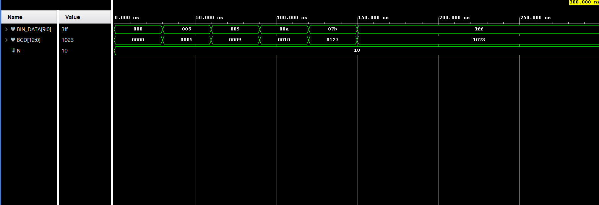
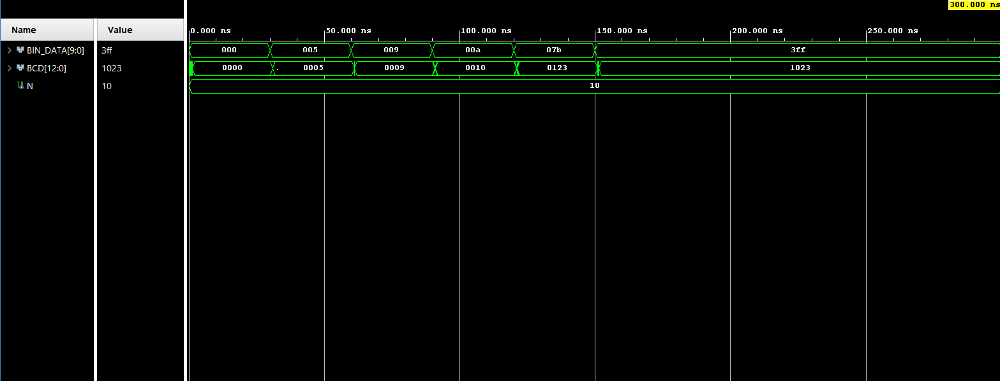

# Double Dabble (Shift-Add-3) algorithm implemented in VHDL.

This project was coded in VHDL using Vivado and implemented on the Xilinx Basys 3 board.

## Features
- Implements the Double Dabble (Shift-Add-3) algorithm for binary to BCD conversion.

- Parameterizable input width using the generic `N`.

- Synthesizable VHDL code, compatible with the Xilinx Vivado toolchain.

- Designed and tested for the Xilinx Basys 3 development board.

- Outputs a BCD representation with automatic bit-width estimation based on the input size.

- Modular and reusable VHDL entity for integration into larger digital systems.


## Note:

```vhdl
(N + (N-4)/3 downto 0)
```
The formula above, used in:

```vhdl
BCD_OUT  : out std_logic_vector(N + (N-4)/3 downto 0)
```

`shift_add_3.vhd` is an estimate of the number of bits required for the `BCD_OUT` vector, based on the generic parameter `N`.
Here, `N` corresponds to the number of bits of the input `BIN_DATA` used in the binary-to-BCD conversion.
Make sure that `BCD_OUT` vector has the correct width for your specific input size.

## Testbench
A VHDL testbench is included to validate the functionality of the shift_add_3 module.
It applies several binary input values and observes the corresponding BCD output generated by the Double Dabble (Shift-Add-3) algorithm.

## Simulation Modes
The testbench supports two simulation modes:

- Functional Simulation:
Uses a generic parameter N to allow flexible testing with different input widths.

- Post-Implementation Timing Simulation (optional):
Requires commenting out the functional lines (marked with `==== BEHAVIORAL SIMULATION ====`) and uncommenting the timing-specific section
marked with `==== TIMING SIMULATION ========`. This mode is suitable for back-annotated simulations after implementation in Vivado.

## Input Stimulus
The following binary values are tested:

- 0000000000 (0)

- 0000000101 (5)

- 0000001001 (9)

- 0000001010 (10)

- 0001111011 (123)

- 1111111111 (1023)

Each value is held for 30 ns to observe the resulting BCD output.

## Running the Simulation
You can simulate the testbench in Vivado as follows:

1. Open the project in Vivado.
2. Set bin_2_bcd_tb as the top-level simulation module.
3. Run the behavioral simulation or timing simulation depending on the selected mode.
4. Observe the waveform output to verify BCD conversion correctness.

## Waveform Example

The waveform below shows the result of applying different binary input values to the `shift_add_3` module, and the corresponding BCD output
using the Behavioral Simulation option.



On the other hand, Timing Simulation is shown as below.

